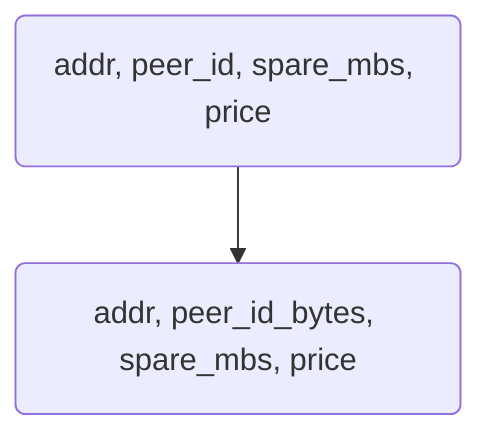
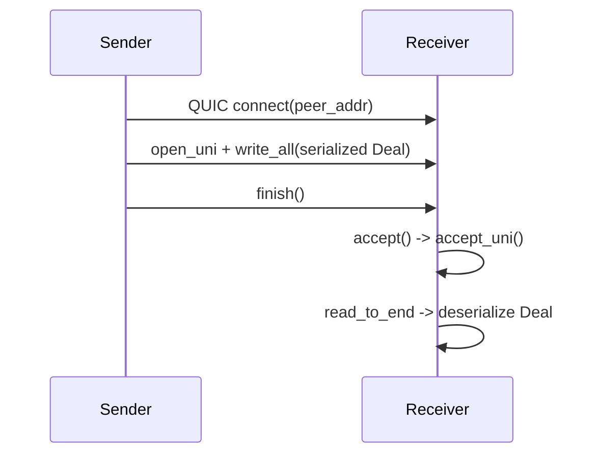

# sparenet-agent

Core networking logic for Sparenet. It bundles:

- `discovery`: local-network peer discovery with multicast or loopback sockets.
- `connection`: QUIC control plane that exchanges `Deal`s describing file size,
  asking price, and the sender’s advertised info.
- `agent`: high-level orchestrator that reuses discovery plus QUIC endpoints to
  match and store deals.

## discovery module

### Data Structures



- `PeerInfo`: in-memory representation, keyed by `libp2p::PeerId`.
- `PeerInfoWire`: serde-friendly type with `peer_id_bytes: ByteBuf` for sending
  over UDP or embedding inside a `Deal`.

### Service Lifecycle

`DiscoveryService::start` clones itself and `tokio::join!`s three tasks:

1. `listen_to_peers`: awaits `socket.recv_from`, checks for the `MAGIC_HEADER`,
   deserializes `PeerInfoWire`, converts to `PeerInfo`, and updates the map with
   `Instant::now()`.
2. `announce_presence`: converts its own `PeerInfo` to wire format, serializes
   via `bincode`, and sends every `ANNOUNCE_INTERVAL` using the same UDP socket.
3. `sweep_timeout_peers`: every second, removes map entries whose last seen time
   exceeds `PEER_TIMEOUT` (5s).

Two constructors exist:
- `with_addr`: binds a UDP socket, joins the multicast group at
  `MULTICAST_ADDR`, and stores the destination; used in production.
- `test_with_addr`: binds to specific loopback addresses for unit tests (no
  multicast support needed).

`get_peer_info()` returns a reference to the local configuration, and
`get_peers()` clones the peer map to a `Vec<PeerInfo>`.

## connection module

### Deal

```rust
pub const BYTES_PER_MEBIBYTE: u64 = 1024 * 1024;

#[derive(Debug, Serialize, Deserialize, Clone)]
pub struct Deal {
    pub peer_info_wire: PeerInfoWire,
    /// File length in bytes (convert MiB via `BYTES_PER_MEBIBYTE`).
    pub file_len: u64,
    pub price_per_mb: f32,
}
```

Every deal carries the sender’s advertised control address (`peer_info_wire.addr`)
and identifying fields, so receivers know who proposed the contract even though
QUIC only exposes the ephemeral source socket.

### Endpoints

- `open_receiver_endpoint(addr)`: generates a self-signed cert using `rcgen`,
  builds a `ServerConfig`, and binds a QUIC endpoint to `addr`.
- `open_sender_endpoint()`: creates a client endpoint (`0.0.0.0:0`) and sets a
  default `ClientConfig`. In production builds, the platform root verifier is
  used; under `#[cfg(test)]`, a “dangerous” custom verifier accepts any cert so
  loopback tests can run without provisioning trust anchors.

### Send/Receive Flow



`send(endpoint, peer_addr, deal)`:
1. `endpoint.connect(peer_addr, "localhost")` establishes a QUIC connection.
2. Opens a unidirectional stream, serializes the deal with `bincode`, writes all
   bytes, and calls `finish()` to signal EOF.

`receive(endpoint)`:
1. Awaits an incoming connection, accepts it, then awaits `accept_uni()`.
2. Reads up to 1 KiB (`read_to_end(1024)`) and deserializes into a `Deal`.

The helper currently returns only the `Deal`; callers must read
`deal.peer_info_wire` to know the sender.

## agent module

`Agent` glues discovery and QUIC:

- Holds `Arc<DiscoveryService>`.
- Owns one receiver endpoint bound to `PeerInfo.addr` and a shared sender
  endpoint for dialing peers.
- Stores an `Arc<Mutex<HashMap<String, Deal>>>` for incoming deals keyed by the
  sender’s advertised `addr`.

### Lifecycle

`Agent::run` spawns discovery and `receive_deals` concurrently. The receiver loop
logs events via `tracing` and records each deal. `send_matched_deals`:

1. Fetches the current peer list (`discovery.get_peers()`).
2. Converts `spare_mbs` to bytes (`spare_mbs * BYTES_PER_MEBIBYTE`), filters
   peers whose spare bytes exceed `deal.file_len`, and checks price.
3. Clones the sender endpoint and calls `connection::send` per peer.

### Tests

- `discovery::tests::discovery_roundtrip_on_loopback`: uses `test_with_addr` to
  verify two services discover each other.
- `connection::tests::round_trip_control_deal`: ignored by default because it
  needs local QUIC permissions; shows a full send/receive cycle.
- `agent::tests::two_agents_communicate`: spins up two agents on loopback,
  waits for discovery, and sends a deal; asserts that each agent sees the other.

All tests require permission to bind the specified loopback ports (e.g.,
`6100-6103`). Run `cargo test -p sparenet-agent` from the repo root.
